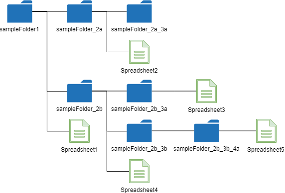

# FilesApp

<a name="top"></a>
[](LICENCE)

<a name="Overview"></a>

# Overview

**FilesApp is a GAS library for retrieving file and folder list in Google Drive using Google Apps Script (GAS). Also this can create a tree from all files and folders in own Google Drive and shared Drives.**

<a name="Description"></a>

# Description

When I create some applications using Google Drive, there are often the case which is required to retrieve the file list and folder list. I had prepared the script each time for each case so far. But recently, I thought that if there is a library for retrieving the file and folder list (as a tree), it will be useful for me and other developers. So I created this. If this was useful for your situation, I'm glad.

# Library's project key

```
1dBxqh6gpWqFv4h0M25ALp4bhcs6CoqhiIJ0fUeUjR57bAxIN2PqfkQns
```

<a name="Howtoinstall"></a>

# How to install

In order to use this library, please install this as a library.

1. [Install FilesApp library](https://developers.google.com/apps-script/guides/libraries).
   - Library's project key is **`1dBxqh6gpWqFv4h0M25ALp4bhcs6CoqhiIJ0fUeUjR57bAxIN2PqfkQns`**.
1. FilesApp uses Drive API. Please enable Drive API at API console.
   - On the Script Editor
     - Resources -> Cloud Platform Project
     - Click the lower part of "This script is currently associated with project:"
   - On "API APIs&services"
     - In "Getting Started", Click "Enable APIs and get credentials like keys".
     - Click Library at left side.
     - At "Search APIs and services", Input "drive api", Click it.
     - Enable "Google Drive API"

> Recently, when it enabled APIs, I had an experience that I was made to wait for several minutes for enabling APIs. So when you enabled APIs at API console, if the error related to APIs occurs, please run again after several minutes.

<a name="Usage"></a>

# Usage

There are 4 methods in this library.

| Method                                                              | Description                                                                                                                                     |
| :------------------------------------------------------------------ | :---------------------------------------------------------------------------------------------------------------------------------------------- |
| createTree(folderId, mimeType, fields, accessToken)                 | Create a file and folder tree. Retrieve all folders of all level under folderId. All files and folders are included in an array with the level. |
| getAllInFolder(folderId, mimeType, fields, accessToken)             | Retrieve all files and folders of all level under folderId. All files and folders are included in an array without the level.                   |
| getAllFoldersInFolder(folderId, accessToken)                        | Retrieve all folders of all level under folderId.                                                                                               |
| getFilesAndFoldersInFolder(folderId, mimeType, fields, accessToken) | Retrieve files and folders just under a folder with folderId.                                                                                   |

#### Arguments

- **folderId** : Folder ID of top folder you want to retrieve. Please use as a string.
  - If you want to retrieve the values under "root", please use "root" for this.
- **mimeType** : mimeType of files you want to retrieve. Please use as an array like `["application/vnd.google-apps.script", "image/png"]`
  - If you use `null` for this, all kinds of files are retrieved.
- **fields** : fields of files you want to retrieve. Please use as a string. This value is the same to `fields` which is used at [files.list of Drive API](https://developers.google.com/drive/api/v3/reference/files/list).
  - If you want to retrieve the filename and ID of files, you can use `"files(id,name)"`
- **accessToken** : When you want to give the access token except for `ScriptApp.getOAuthToken()`, please use this. When this is not used, `ScriptApp.getOAuthToken()` is used as the default access token. For example, when this is used, the file list in Drive of the service account can be retrieved.

# Samples

In order to explain the following sample script, it supposes that there is this structure in Google Drive. In this case, it doesn't need that "sampleFolder1" is root.



## 1. createTree(folderId, mimeType, fields)

`folderId` is the ID of "sampleFolder1". In this sample, the filenames of files with all mimeTypes are retrieved.

**When "root" is used for "folderId", all files of Google Drive can be retrieved.**

```javascript
var res = FilesApp.createTree(folderId, null, "files(name)");
```

##### Result

The index of the array of `folderTreeById` and `folderTreeByName` is corresponding to the level of folders.

```json
{
  "topFolderId": ["### FolderId of sampleFolder1 ###"],
  "topFolderName": ["sampleFolder1"],
  "totalFilesAndFolders": 11,
  "totalFiles": 4,
  "totalFolders": 7,
  "files": [
    {
      "folderTreeById": ["### FolderId of sampleFolder1 ###"],
      "folderTreeByName": ["sampleFolder1"],
      "filesInFolder": [
        {
          "name": "Spreadsheet1",
          "parents": ["### FolderId of sampleFolder1 ###"]
        },
        {
          "name": "sampleFolder_2b",
          "parents": ["### FolderId of sampleFolder1 ###"]
        },
        {
          "name": "sampleFolder_2a",
          "parents": ["### FolderId of sampleFolder1 ###"]
        }
      ]
    },
    {
      "folderTreeById": [
        "### FolderId of sampleFolder1 ###",
        "### FolderId of sampleFolder_2b ###"
      ],
      "folderTreeByName": ["sampleFolder1", "sampleFolder_2b"],
      "filesInFolder": [
        {
          "name": "Spreadsheet4",
          "parents": ["### FolderId of sampleFolder_2b ###"]
        },
        {
          "name": "sampleFolder_2b_3b",
          "parents": ["### FolderId of sampleFolder_2b ###"]
        },
        {
          "name": "sampleFolder_2b_3a",
          "parents": ["### FolderId of sampleFolder_2b ###"]
        }
      ]
    },
    {
      "folderTreeById": [
        "### FolderId of sampleFolder1 ###",
        "### FolderId of sampleFolder_2b ###",
        "### FolderId of sampleFolder_2b_3b ###"
      ],
      "folderTreeByName": [
        "sampleFolder1",
        "sampleFolder_2b",
        "sampleFolder_2b_3b"
      ],
      "filesInFolder": [
        {
          "name": "sampleFolder_2b_3b_4a",
          "parents": ["### FolderId of sampleFolder_2b_3b ###"]
        }
      ]
    },
    {
      "folderTreeById": [
        "### FolderId of sampleFolder1 ###",
        "### FolderId of sampleFolder_2b ###",
        "### FolderId of sampleFolder_2b_3b ###",
        "### FolderId of sampleFolder_2b_3a ###"
      ],
      "folderTreeByName": [
        "sampleFolder1",
        "sampleFolder_2b",
        "sampleFolder_2b_3b",
        "sampleFolder_2b_3b_4a"
      ],
      "filesInFolder": [
        {
          "name": "Spreadsheet5",
          "parents": ["### FolderId of sampleFolder_2b_3a ###"]
        }
      ]
    },
    {
      "folderTreeById": [
        "### FolderId of sampleFolder1 ###",
        "### FolderId of sampleFolder_2b ###",
        "### FolderId of sampleFolder_2b_3a ###"
      ],
      "folderTreeByName": [
        "sampleFolder1",
        "sampleFolder_2b",
        "sampleFolder_2b_3a"
      ],
      "filesInFolder": [
        {
          "name": "Spreadsheet3",
          "parents": ["### FolderId of sampleFolder_2b_3a ###"]
        }
      ]
    },
    {
      "folderTreeById": [
        "### FolderId of sampleFolder1 ###",
        "### FolderId of sampleFolder_2a ###"
      ],
      "folderTreeByName": ["sampleFolder1", "sampleFolder_2a"],
      "filesInFolder": [
        {
          "name": "Spreadsheet2",
          "parents": ["### FolderId of sampleFolder_2a ###"]
        },
        {
          "name": "sampleFolder_2a_3a",
          "parents": ["### FolderId of sampleFolder_2a ###"]
        }
      ]
    },
    {
      "folderTreeById": [
        "### FolderId of sampleFolder1 ###",
        "### FolderId of sampleFolder_2a ###",
        "### FolderId of sampleFolder_2a_3a ###"
      ],
      "folderTreeByName": [
        "sampleFolder1",
        "sampleFolder_2a",
        "sampleFolder_2a_3a"
      ],
      "filesInFolder": []
    }
  ]
}
```

## 2. getAllInFolder(folderId, mimeType, fields)

```javascript
var res = FilesApp.getAllInFolder(folderId, null, "files(name)");
```

##### Result

All files and folders in a folder you set are retrieved. But it is not as a tree. The speed is faster than `createTree()`.

```json
[
  { "name": "Spreadsheet5" },
  { "name": "Spreadsheet4" },
  { "name": "Spreadsheet3" },
  { "name": "Spreadsheet2" },
  { "name": "Spreadsheet1" },
  { "name": "sampleFolder_2b_3b_4a" },
  { "name": "sampleFolder_2a_3a" },
  { "name": "sampleFolder_2b" },
  { "name": "sampleFolder_2a" },
  { "name": "sampleFolder_2b_3b" },
  { "name": "sampleFolder_2b_3a" }
]
```

## 3. getAllFoldersInFolder(folderId)

```javascript
var res = FilesApp.getAllFoldersInFolder(folderId);
```

##### Result

All folders in a folder you set are retrieved as a tree.

```json
{
  "id": [
    ["### ID of sampleFolder1 ###"],
    ["### ID of sampleFolder1 ###", "### ID of sampleFolder_2b ###"],
    [
      "### ID of sampleFolder1 ###",
      "### ID of sampleFolder_2b ###",
      "### ID of sampleFolder_2b_3b ###"
    ],
    [
      "### ID of sampleFolder1 ###",
      "### ID of sampleFolder_2b ###",
      "### ID of sampleFolder_2b_3b ###",
      "### ID of sampleFolder_2b_3b_4a ###"
    ],
    [
      "### ID of sampleFolder1 ###",
      "### ID of sampleFolder_2b ###",
      "### ID of sampleFolder_2b_3a ###"
    ],
    ["### ID of sampleFolder1 ###", "### ID of sampleFolder_2a ###"],
    [
      "### ID of sampleFolder1 ###",
      "### ID of sampleFolder_2a ###",
      "### ID of sampleFolder_2a_3a ###"
    ]
  ],
  "name": [
    ["sampleFolder1"],
    ["sampleFolder1", "sampleFolder_2b"],
    ["sampleFolder1", "sampleFolder_2b", "sampleFolder_2b_3b"],
    [
      "sampleFolder1",
      "sampleFolder_2b",
      "sampleFolder_2b_3b",
      "sampleFolder_2b_3b_4a"
    ],
    ["sampleFolder1", "sampleFolder_2b", "sampleFolder_2b_3a"],
    ["sampleFolder1", "sampleFolder_2a"],
    ["sampleFolder1", "sampleFolder_2a", "sampleFolder_2a_3a"]
  ]
}
```

## 4. getFilesAndFoldersInFolder(folderId, mimeType, fields)

```javascript
var res = FilesApp.getFilesAndFoldersInFolder(folderId, null, "files(name)");
```

##### Result

All files and folders just under a folder you set are retrieved.

```json
[
  { "name": "Spreadsheet1" },
  { "name": "sampleFolder_2b" },
  { "name": "sampleFolder_2a" }
]
```

# For other languages

As the libraries "GetFileList" for other languages, there are following libraries.

- Golang: [https://github.com/tanaikech/go-getfilelist](https://github.com/tanaikech/go-getfilelist)
- Google Apps Script: [https://github.com/tanaikech/FilesApp](https://github.com/tanaikech/FilesApp)
- Javascript: [https://github.com/tanaikech/GetFileList_js](https://github.com/tanaikech/GetFileList_js)
- Node.js: [https://github.com/tanaikech/node-getfilelist](https://github.com/tanaikech/node-getfilelist)
- Python: [https://github.com/tanaikech/getfilelistpy](https://github.com/tanaikech/getfilelistpy)

---

<a name="Licence"></a>

# Licence

[MIT](LICENCE)

<a name="Author"></a>

# Author

[Tanaike](https://tanaikech.github.io/about/)

If you have any questions and commissions for me, feel free to tell me.

<a name="Update_History"></a>

# Update History

- v1.0.0 (June 15, 2018)

  1. Initial release.

- v1.0.1 (September 3, 2018)

  1. Removed a bug.
     - When there are files and folders without the parents, an error occurred. In this version, this issue was removed.

- v1.1.0 (May 14, 2020)

  1. Shared drive got to be able to be used. From the version 1.1.0, the following modification was added.
     1. V8 is used.
     1. As the default setting, the file list is retrieved from both your Google Drive and the shared drive.
        - By this, for example, when the folder ID in the shared Drive is used to `###` of `const res = FilesApp.createTree("###")`, the folder tree of the shared Drive is retrieved, if you have the shared Drive.

- v1.1.1 (May 14, 2020)

  1. `options` was removed. Because in this library, the file list is retrieved under the specific folder, and this library doesn't directly search the specific files.

- v1.1.2 (May 29, 2020)

  1. A bug that all files were not retrieved from the shared drive was removed.

- v1.1.3 (December 12, 2020)

  1. Access token got to be able to be given as an argument. When the access token is not given as the argument, `ScriptApp.getOAuthToken()` is used as the default access token. By this, the service account can be used.

- v1.1.4 (June 5, 2024)

  1. A bug for retrieving metadata from the shared drive was removed.

[TOP](#top)
